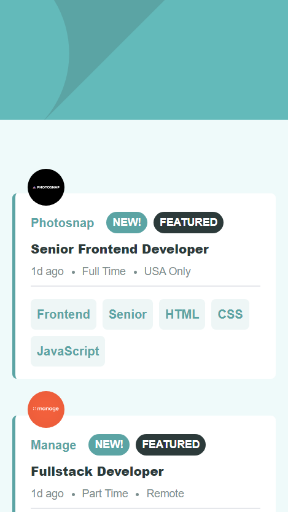
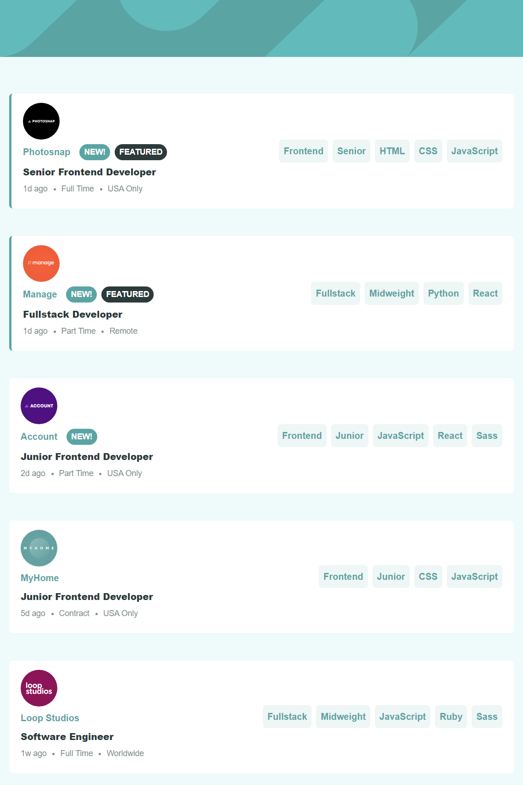

# Frontend Mentor - Job listings with filtering solution

This is a solution to the [Job listings with filtering challenge on Frontend Mentor](https://www.frontendmentor.io/challenges/job-listings-with-filtering-ivstIPCt). Frontend Mentor challenges help you improve your coding skills by building realistic projects. 

## Table of contents

- [Overview](#overview)
  - [The challenge](#the-challenge)
  - [Screenshot](#screenshot)
  - [Links](#links)
- [Author](#author)

## Overview

### The challenge

Users should be able to:

- View the optimal layout for the site depending on their device's screen size
- See hover states for all interactive elements on the page
- Filter job listings based on the categories

### Screenshot

### Links

- Solution URL: [Solution](https://github.com/velvetrose/job-listing-with-filtering)
- Live Site URL: [Live site](https://velvetrose.github.io/job-listing-with-filtering/)

### Built with

- Semantic HTML5 markup
- Flexbox
- Mobile-first workflow
- Vanilla Js
- [Tailwind CSS](https://tailwindcss.com) - CSS Framework

## Author
- Frontend Mentor - [@velvetrose](https://www.frontendmentor.io/profile/velvetrose)
